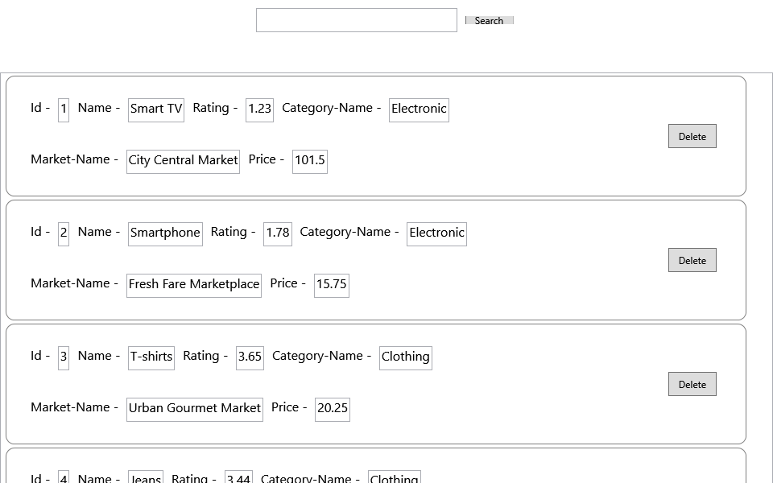
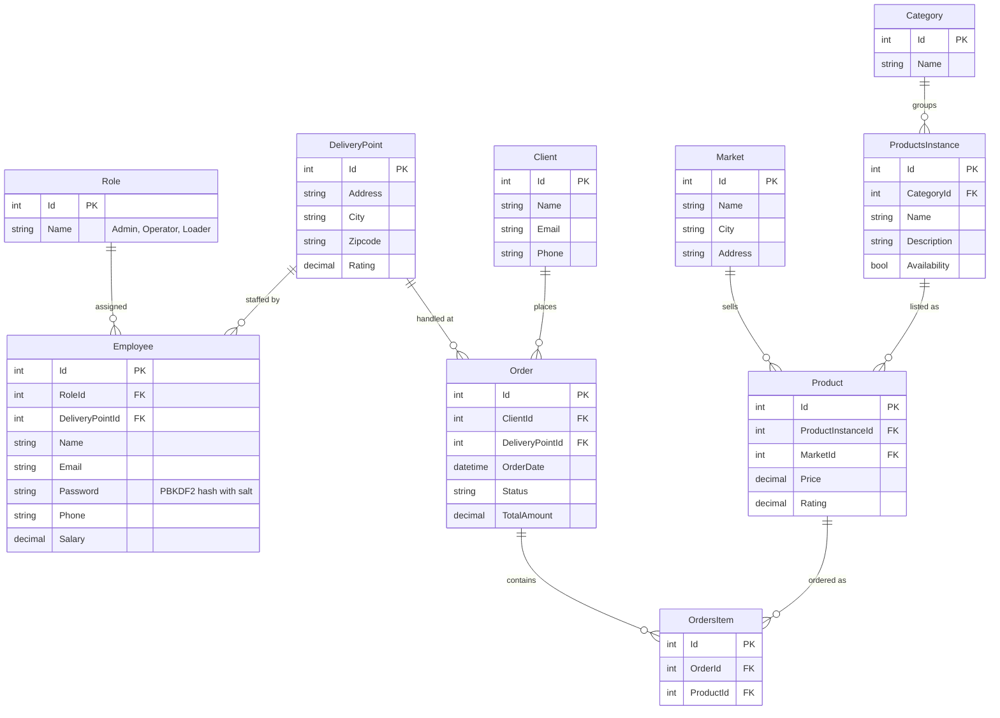
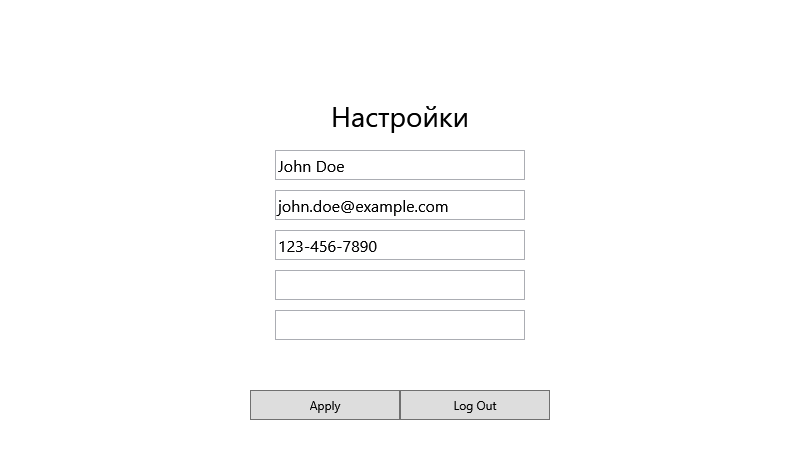
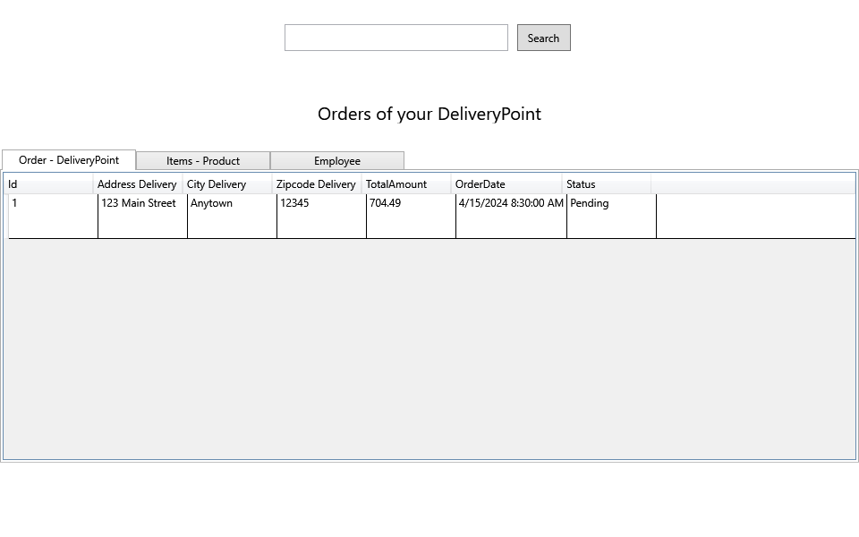
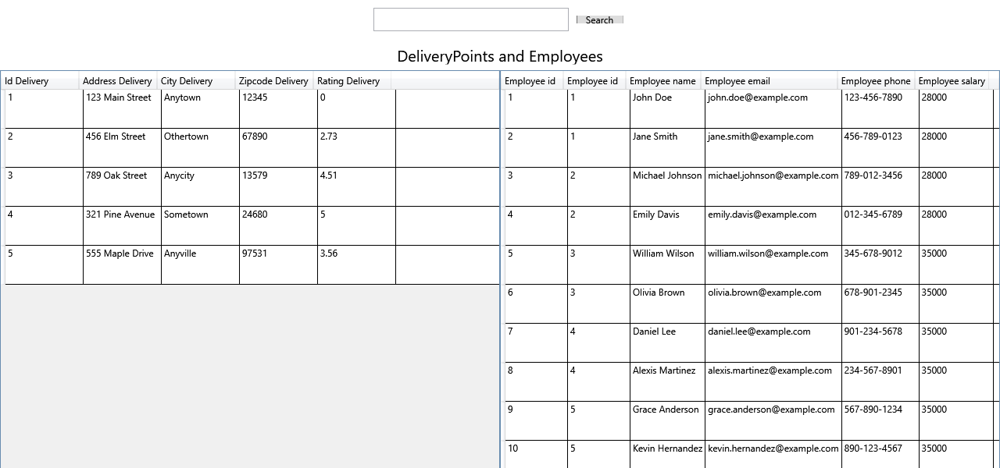

# Marketplace

A desktop client for an online-marketplace back office: a paginated product
catalogue with search across sellers and categories, employee accounts with
roles, and per-pickup-point views of orders and staff. Built as a WPF
application on hand-written MVVM — no MVVM framework, no code-behind logic —
over EF Core.

A course project (VKI NSU, spring 2024), written against a T-SQL assignment:
design a 3NF schema for a Wildberries/Ozon-style store, fill it, and query it.
The database from that assignment is the one the application runs on.

[](https://github.com/nupolovykh/WPF-MVVM-marketplace/actions/workflows/ci.yml)




> The interface is in Russian; this README, the code and the commit history are
> in English.

## Tech Stack

| Layer | Technology |
| --- | --- |
| UI | WPF (net8.0-windows), MVVM by hand: `ICommand` implementations, `INotifyPropertyChanged`, no framework |
| Composition | Generic Host + `Microsoft.Extensions.DependencyInjection`, one extension method per concern in `HostBuilders/` |
| Navigation | A `Navigator` holding the current view model; views are picked by `DataTemplate` in `App.xaml`, no `Frame` or URI routing |
| Data access | EF Core 8, SQLite by default, SQL Server provider also referenced |
| Mapping | AutoMapper, entities to DTOs the views bind to |
| Passwords | PBKDF2-HMAC-SHA256, 100k iterations, per-password salt |
| CI | GitHub Actions: build on Linux and Windows, functional smoke test, headless screenshots |

## Quick Start

Windows and the [.NET SDK 8.0](https://dotnet.microsoft.com/download/dotnet/8.0)
are all that is needed — the WPF head targets `net8.0-windows`, and the database
is created on first run.

```bash
git clone https://github.com/nupolovykh/WPF-MVVM-marketplace.git
cd WPF-MVVM-marketplace
dotnet run --project Marketplace.Wpf
```

EF Core creates `app.db` in the working directory — the repository root, if you
run the command above from there — and applies the seed data: 3
roles, 10 employees, 5 pickup points, 5 sellers, 5 categories, 20 product
listings, 10 clients and 5 orders. Sign in with a seeded account — `John Doe` /
`123` (an administrator), or any other seeded name, all with the same demo
password. Registration creates an account in the `Loader` role. The login field
accepts the name or the email address.

Configuration lives in [`Marketplace.Wpf/appsettings.json`](Marketplace.Wpf/appsettings.json):

- `ConnectionStrings:sqlite` — the database. Override it without touching the
  file via the `ConnectionStrings__sqlite` environment variable; point it at
  SQL Server by also switching the provider in
  `AddDbContextHostBuilderExtensions`.
- `Database:RecreateOnStartup` — when `true`, the database is dropped at launch
  and rebuilt from the seed. Off by default; deleting `app.db` has the same
  effect.

The domain and data layers are platform-independent, so they can be built and
exercised on Linux too:

```bash
dotnet run --project Marketplace.SmokeTest   # the CI smoke test, against a throwaway database
```

## Features

- **Sign-in and registration** — passwords stored as salt + PBKDF2-HMAC-SHA256;
  duplicate names and emails are reported rather than silently accepted.
- **Product catalogue** (`Главная`) — 10 listings per page with paging, each
  drawn by a `ProductCard` custom control showing seller, category, rating and
  price.
- **Search** — one box matching the seller's name, the product name or its
  category, applied to the paged query rather than to the loaded page.
- **Catalogue editing** — administrators and operators can add, edit and delete
  listings; a listing that appears in an order from the last two months is
  refused deletion.
- **Profile** (`Профиль`) — name, email and phone; leaving both password boxes
  empty keeps the current password.
- **Your pickup point** (`Ваш ПВЗ`) — orders handled at the signed-in employee's
  pickup point, with their items and clients, searchable by pickup point, by
  product or by the employee who served the order.
- **Statistics** (`Статистика`) — pickup points and the employees working at
  them, searchable.
- **Roles** — `Admin`, `Operator`, `Loader`; role-gated controls disappear for
  accounts that may not use them.

## Architecture

### Projects

| Project | Responsibility |
| --- | --- |
| [`Marketplace.Wpf`](Marketplace.Wpf) | Views, view models, commands, custom controls, converters, DTOs, application state, host composition |
| [`Marketplace.Domain`](Marketplace.Domain) | Services over the data layer: accounts, authentication, products, delivery; password hashing; domain exceptions |
| [`Marketplace.EntityFramework`](Marketplace.EntityFramework) | `AppDbContext`, entities, per-entity model configuration with seed data, generic CRUD services |
| [`Marketplace.SmokeTest`](Marketplace.SmokeTest) | Functional test of the two layers above, run in CI |
| [`Marketplace.Wpf.Screenshot`](Marketplace.Wpf.Screenshot) | Headless renderer that produces the screenshots below |
| [`Marketplace.Playground`](Marketplace.Playground) | Scratch project: creates the database without the UI, plus the async/threading experiments kept from development |

### Flow

```
View (XAML)
  │  bindings, ICommand
ViewModel  ──────────────►  State: Navigator, AccountStore, Authenticator,
  │                                 ProductWorker, DeliveryWorker
  │  DTOs (AutoMapper)
Domain services  ────────►  AppDbContextFactory ──► EF Core ──► SQLite / SQL Server
```

Every view model takes what it needs through its constructor; nothing resolves
services from a container at runtime. The host is assembled from one extension
method per concern in
[`Marketplace.Wpf/HostBuilders/`](Marketplace.Wpf/HostBuilders):
`AddConfiguration`, `AddDbContext`, `AddStores`, `AddServices`, `AddViewModels`,
`AddMapping`, `AddViews`.

Navigation has no `Frame` and no routing table: `MainWindow` binds a
`ContentControl` to `Navigator.CurrentViewModel`, and the `DataTemplate`
entries in [`App.xaml`](Marketplace.Wpf/App.xaml) map each view-model type to
its view. `ViewModelDelegateRenavigator<T>` is how a command (a successful
login, say) moves the user on without knowing anything about views.

### Database Schema



`ProductsInstance` is the product itself — a name, a description, a category.
`Product` is one seller's listing of it, with that seller's price and rating, so
the same item sold by five markets is five `Product` rows and one
`ProductsInstance`. Orders reference listings, not products.

The schema is created with `EnsureCreated()`; there are no migrations. Every
entity's column mapping and seed data lives in its own configuration class in
[`EntitiesBuilders/`](Marketplace.EntityFramework/EntitiesBuilders).

## CI

[`.github/workflows/ci.yml`](.github/workflows/ci.yml) does four things:

1. **Builds the portable projects on Linux** — domain, data access, playground
   and smoke test, none of which touch Windows-only APIs.
2. **Builds the whole solution on Windows**, where the WPF head can actually be
   compiled.
3. **Runs a functional smoke test** against a throwaway SQLite database:
   `EnsureCreated` with the full seed, sign-in for a seeded account by name and
   by email, rejected sign-ins, a register → sign-in round trip, rejection
   reasons leaving no rows behind, a profile save that keeps the current
   password, catalogue paging with its navigations loaded, search page counts,
   and id assignment. A build says the code compiles; this says it works.
4. **Renders the screenshots below** on a Windows runner without ever showing a
   window: the harness boots the real host, seeds, signs in, resolves a view
   model out of DI, waits for it to finish loading and draws the view through
   `RenderTargetBitmap`. A follow-up job commits the PNGs into `docs/img/`, so
   the pictures in this README are regenerated from the actual application
   whenever the XAML changes.

## Screenshots

| Sign-in | Registration |
| --- | --- |
|  |  |

| Profile | Your pickup point | Statistics |
| --- | --- | --- |
|  |  |  |

## Status and What Should Have Been Done Differently

Submitted in May 2024 and not developed since. What follows is an honest
assessment; the first half has been dealt with, the second half has not.

**Fixed after submission:**

- The database was deleted and rebuilt from seed data on *every* launch —
  `RecreateDatabase(host, true)`, with the flag hard-coded. Nothing a user
  registered or changed survived a restart. It is a configuration switch now,
  off by default.
- Passwords were hashed by `Microsoft.AspNet.Identity.Core`, a .NET Framework
  4.5 package that only resolved through the SDK's net461 fallback. Replaced
  with PBKDF2-HMAC-SHA256 and a constant-time comparison.
- Seed hashes were computed inside `OnModelCreating` with a random salt, so the
  model was different on every run — which rules out migrations by itself.
- `EnableSensitiveDataLogging` was on unconditionally, sending query parameters
  and password hashes to the trace listener in release builds.
- `appsettings.json` shipped connection strings pointing at the author's own
  machines.
- Sign-in only matched the employee name although the field is labelled
  "Login / Email"; registration signed the user in even when it had rejected
  them, and never checked whether the email was taken.
- Saving the profile required retyping the password twice and re-hashed
  whatever was in the box.
- Deleting a listing loaded every product and every recent order into memory to
  build a cross product, then refused the deletion if *any* product had a
  recent order. Counting search results materialised them all. New ids came
  from row counts, which collide after a delete.
- The app could not start from the repository root at all: configuration was
  resolved against the working directory rather than the assembly's.
- Targeted net6.0, out of support since November 2024.

**Still true:**

- No unit tests. The smoke test covers the domain and data layers end to end,
  but nothing tests a view model in isolation, and the WPF layer is verified
  only by "it renders".
- `EnsureCreated()` instead of migrations: the schema cannot change without
  dropping the database.
- Seed accounts share the password `123`, and they exist in every deployment.
- The SQL Server path is referenced and configured but never exercised in CI —
  only SQLite is.
- Roles gate visibility in the UI, not the services underneath them: nothing
  stops a `Loader` account from reaching product mutation through the service
  layer.
- Business logic sits in commands and view models; the "domain services" are
  mostly CRUD wrappers over `DbContext`, and paging constants like "10 per
  page" are private statics in the service.
- The UI is untranslated Russian with hard-coded strings and hand-placed
  margins; there is no theming, no resource dictionary, and no localisation.

## Documentation

- [Original assignment](docs/assignment.md) — the T-SQL brief the project was
  written against: the schema to build, the data to load and the ten queries to
  implement, with the original wording preserved. The `.docx` originals are in
  [`docs/assignment/`](docs/assignment).
- [`docs/sql/schema-and-seed.sql`](docs/sql/schema-and-seed.sql) — the script
  taken off the working SQL Server database, re-encoded from UTF-16 so GitHub
  can display it.
